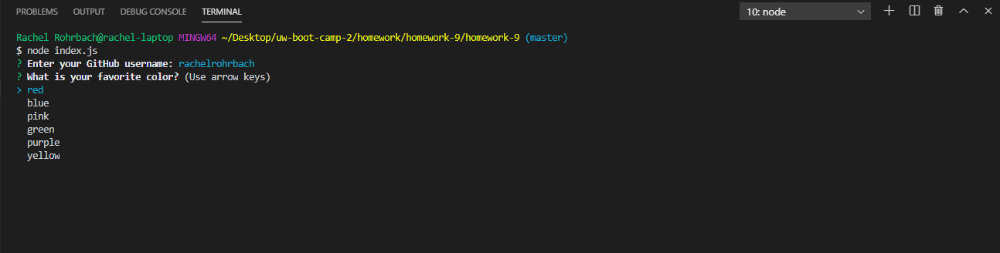

# Developer Profile Generator

## Table of contents
* [General info](#general-info)
* [Technologies](#technologies)
* [Screenshots](#screenshots)
* [Credits](#credits)
* [License](#license)

## General info
This project is a command-line application that dynamically generates a PDF profile from a GitHub username. First the user must use the following command to install dependencies required:
```sh
npm install
```
The application is then invoked with the following commands:
```sh
node index.js
```
The user is then prompted for a favorite color, which will be used as the background color for the generated html and pdf.  
There are also unit tests included to test that the response object is correctly being passed to the generateHTML function which can be invoked with the following command:
```sh
npm run test
```
## Technologies
This project is created with: 
* Node.js 
* Bootstrap 4
* CSS
* Font Awesome
* Google Fonts
* HTML
* JavaScript

## Screenshots 



Link to application demo video video: (https://drive.google.com/file/d/1X8PO_jn1dXyT_SZhV94mvRgcp2J6KzXS/view?usp=sharing)


# Credits
I consulted Bootstrap 4 (https://getbootstrap.com/), NPMSJ (https://www.npmjs.com/package/puppeteer), Rising Stack https://blog.risingstack.com/pdf-from-html-node-js-puppeteer/#option3), Encycolorpedia (https://encycolorpedia.com/html), JavaScript Info (https://javascript.info/async-await), MDN Web Docs Stack Overflow (#https://stackoverflow.com/), the GitLab repository for my course extensively in creating my project. 

## License
MIT License

Copyright (c) [2019] [Rachel Rohrbach]

Permission is hereby granted, free of charge, to any person obtaining a copy
of this software and associated documentation files (the "Software"), to deal
in the Software without restriction, including without limitation the rights
to use, copy, modify, merge, publish, distribute, sublicense, and/or sell
copies of the Software, and to permit persons to whom the Software is
furnished to do so, subject to the following conditions:

The above copyright notice and this permission notice shall be included in all
copies or substantial portions of the Software.